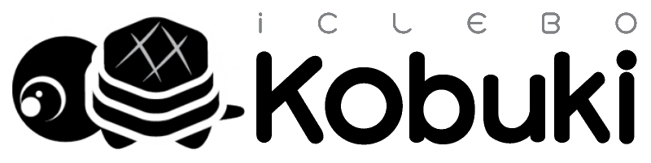

# Kobuki Core - Under Construction

----

The Kobuki Core stack consists of pure c++ libraries and utilities for working with the [Kobuki Robot Research Platform](http:/kobuki.yujinrobot.com). 

----

## Documentation

* [kobuki_driver - README](https://github.com/kobuki-base/kobuki_core/blob/devel/kobuki_driver/README.md) - user guide for consumers of the c++ libraries
* [kobuki_driver - Doxygen]() - protocol specification and api
* [kobuki_dock_drive - README](https://github.com/kobuki-base/kobuki_core/blob/devel/kobuki_driver/README.md) - example algorithm for controlling the kobuki with the docking station

## Other Resources

* [kobuki_ftdi - README](https://github.com/kobuki-base/kobuki_ftdi/blob/devel/README.md) - troubleshooting and flashing the kobuki ftdi usb-serial connection
* [Kobuki Home Page](http://kobuki.yujinrobot.com) - home page, sales, specifications and hardware howto
* For [ROS2](https://index.ros.org/doc/ros2/) support, refer to [kobuki-base/kobuki_ros/README.md](https://github.com/kobuki-base/kobuki_ros/blob/devel/README.md)
* For [ROS1](http://wiki.ros.org/) support, refer to [http://wiki.ros.org/kobuki](http://wiki.ros.org/kobuki)
* For legacy kobuki core support (circa 2020), refer to [yujinrobot/kobuki_core/README.md](https://github.com/yujinrobot/kobuki_core/blob/melodic/README.markdown)

Testies 1 2
